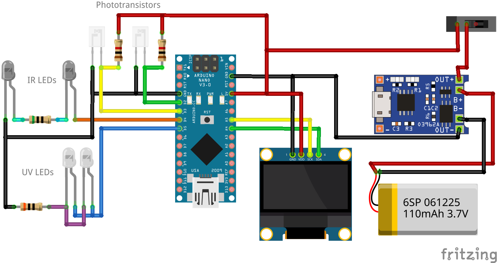
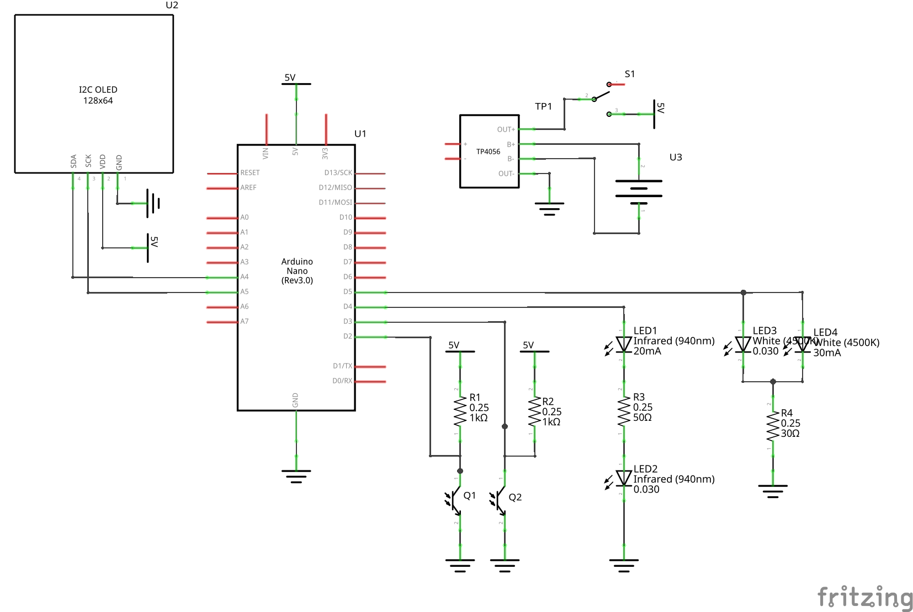
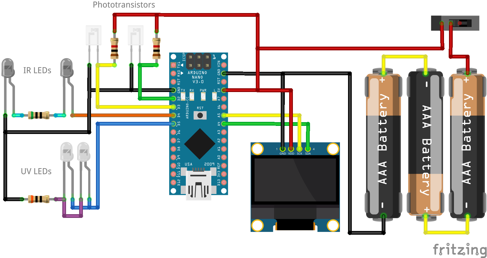

# OpenChrono

Chronograph for Airsoft use, released as Free Open Source hardware and software!

Uses a 3D printed housing to hold an Arduino, an OLED display, batteries and two photosensitive IR light barriers.

Fixed mounting on the front of the gun in the style of a silencer.

Can optionally also include UV LEDs to illuminate tracer BBs.

Please also [take a look at the write-up on my website](https://www.xythobuz.de/openchrono.html)!

## Hardware

Use the included OpenSCAD design file in `hardware/openchrono.scad` to render your own custom STLs that fit your use-case.

### Required Parts

Besides some common stuff like soldering wire and hotglue you need the following parts to build this project.

| Description        | Type          | Count |
| ------------------ | ------------- | ----- |
| Arduino Nano       |               | 1x    |
| LCD 128x64 I2C     | SSD1306 0.96" | 1x    |
| Slide Switch       |               | 1x    |
| IR Phototransistor | SFH 309 FA-5  | 2x    |
| IR LED 3mm         |               | 2x    |
| Resistor           | 1k Ohm        | 2x    |
| Resistor           | 50 Ohm        | 1x    |
| Screw              | M2 10mm       | 4x    |
| Screw              | M2.5 10mm     | 2x    |
| Screw              | M3 16mm       | 8x    |
| Heatmelt Insert    | M3 <= 10mm    | 8x    |

For the UV tracer option you also need the following parts.

| Description | Type    | Count |
| ----------- | ------- | ----- |
| UV LED 3mm  |         | 2x    |
| Resistor    | 50 Ohm  | 1x    |

You have different options for powering the project.
My first version for testing uses a pre-made AA battery holder.

| Description    | Type      | Count |
| -------------- | --------- | ----- |
| AA Battery     |           | 3x    |
| AA Bat. Holder |           | 1x    |
| Screw (sunk)   | M3 <= 6mm | 2x    |

The originally intended variant is a AAA battery holder printed into the model.
I don't have the terminals for that yet so it is not finished.

| Description        | Type | Count |
| ------------------ | ---- | ----- |
| AAA Battery        |      | 3x    |
| Bat. Terminal Neg. |      | 3x    |
| Bat. Terminal Pos. |      | 3x    |

The AA and AAA options are not recommended due to their bulk and weight!
They also have problems with disconnections on firing impulses.

The preferred version uses a single LiPo cell and a charger PCB.

| Description     | Type      | Count |
| --------------- | --------- | ----- |
| LiPo Battery    | 600mAh    | 1x    |
| Resistor SMD    | 4k Ohm    | 1x    |
| Charging Module | TP4056    | 1x    |
| Screw           | M3 <= 6mm | 4x    |

Be careful though!
If you use the LiPo charger board, they normally come with the charge current set to 1A with a 1.2k Ohm resistor.
You need to put in a higher valued resistor instead, otherwise the small battery will be charged with far too much current and the charger will get very hot.
I recommend 4k Ohm or more.
See [this page for more info](https://www.best-microcontroller-projects.com/tp4056.html#TP4056_Current_Programming_Resistor).

### Resistor Values

The proper values for the IR LED current-limiting resistors, as well as the pull-up resistors for the phototransistors depend on the exact parts used.
We want to run the transistor in "switch mode", as [described here](https://www.electronics-notes.com/articles/electronic_components/transistor/phototransistor-circuits-applications.php).
So we need to keep the pull-up value low enough that it quickly is able to pull the IO back to high when the BB passes.
At the same time we also want the LED resistor as low as possible, so the transistor properly switches the IO to low when the light is shining on it.

I built a first prototype with potis instead of resistors on the outside of the case, to be able to adjust the values while measuring the outputs with an oscilloscope.
Using this setup, I arrived at values of 100 Ohm for the LEDs at 4V supply voltage, and 1k Ohm for the phototransistors.
When I later ran again with batteries that had a bit lower voltage, it no longer worked reliably.
So for use with 3x AA(A) batteries, I went down to 50 Ohm for the LEDs.

Also note the type of the phototransistor, "SFH 309 FA-5".
The '5' at the end gives the current that passes when light shines on the sensor, in this case 1.6mA - 3.2mA.
So if you use a different sensor you will probably have to adjust the resistor values!

## Software

This project uses the [U8g2 library by olikraus](https://github.com/olikraus/u8g2) to draw to the I2C OLED display.

You can compile and flash the software using either PlatformIO or the standard Arduino IDE.

With the Arduino IDE [install the U8g2 library using the Library Manager](https://github.com/olikraus/u8g2/wiki/u8g2install) and then flash as usual.

For PlatformIO run something like the following command.

    pio run -t upload --upload-port /dev/ttyUSB0

Replace `/dev/ttyUSB0` with the port you are using.

### Configuration

Take a look at `firmware/OpenChrono/config.h`.
This file contains all the settings you can change as a user.

The most important setting is `SENSOR_DISTANCE`, which is given from the 3D model of the case.
It is echoed when rendering the OpenSCAD design.

You can set `BB_WEIGHT` to the one you use most commonly, and `BB_WEIGHTS` to others interesting for you (`BB_WEIGHTS` should include `BB_WEIGHT`).
These values are used to calculate the energy in Joules.

Set `PREFERRED_UNITS` to what you would like to see in the 2D graph.

The range of speeds that can be measured is determined by `TIMER_PRESCALER`.
Take a look at the comment in `firmware/OpenChrono/ticks.cpp` for details.

## License

OpenChrono is licensed under the [GNU General Public License](https://www.gnu.org/licenses/gpl-3.0.en.html).

    Copyright (c) 2022 Thomas Buck <thomas@xythobuz.de>

    OpenChrono is free software: you can redistribute it and/or modify
    it under the terms of the GNU General Public License as published by
    the Free Software Foundation, either version 3 of the License, or
    (at your option) any later version.

    OpenChrono is distributed in the hope that it will be useful,
    but WITHOUT ANY WARRANTY; without even the implied warranty of
    MERCHANTABILITY or FITNESS FOR A PARTICULAR PURPOSE.  See the
    GNU General Public License for more details.

    You should have received a copy of the GNU General Public License
    along with OpenChrono.  If not, see <https://www.gnu.org/licenses/>.
